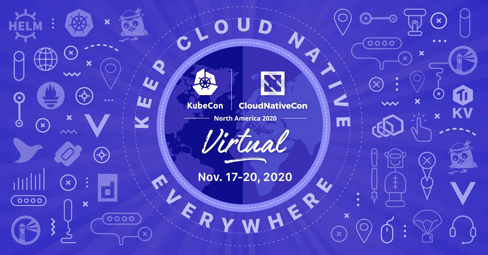

I attended KubeCon + CloudNativeCon North America 2020, held virtually, on a [diversity scholarship](https://events.linuxfoundation.org/kubecon-cloudnativecon-north-america/attend/diversity-scholarships/). It was my first Kubecon and though held virtually, I had a lot of fun. This is my personal accounting of attending this conference.

## Day 0

In a real life conference, time zones wouldn't have been a problem. But they are a problem in virtual conferences (nothing anyone can do about). Still, luckily, most of the talks and workshops I wanted to attend were at a favorable time for me. The first talk I attended was **A Flight Over the Cloud Native Landscape by Carson Anderson, Weave**. This was a really great session for someone new to CNCF community. Carson gave a quick intro to 33 graduated and incubating projects and how they relate to each other. 

I also enjoyed sponsor sessions **The 2020 Open Source Jobs Report - Cloud's rise and the impact of COVID by Clyde Seepersad** and **Kubernetes Is Not Just Kubernetes – Ramp Up with These Eight Open Source Projects by Kenny Coleman** which gave a lot of insight about the development in the open source community.

An advantage of virtual talks is that I didn't have to make scribbles (aka notes) during the talks. I could just watch on-demand videos with the presentations slides all over again. Win win 😉.

## Day 1

Zoom and the newly discovered [rambly](https://rambly.app/) (kudos to [Alison Dowdney](https://twitter.com/alisondowdney)) made up for the lack of one-to-one interaction. I connected with a lot of people and contributors through these channels. Everyone was very kind and gave me a lot of advices for further contributions and involvement in open source.

The really enjoyed the workshop **Migration 101: From VMs to Kubernetes by Luke Kysow and Iryna Shustava** and further interacted with them via the the live Q/A and slack channels.

For the rest of the day, I attended a few **Graduated Project Lightning Talk** until I could resist my sleep.

## Day 2

The keynote **The Cloud Native Journey @Apple by Alena Prokharchyk** was awesome. Great to see software giants involvevement into the open source community.

In **The Building Blocks of DX: K8s Evolution From CLI to GitOps by Katie Gamanji**, I finally got to understand a lot of buzzwords and terms I heard around in the community; especially the term **SheetOps** (never heard before the talk).

I learned a lot of tricks I can do with the cache via **Contain Your Enthusiasm for Go Dev: Fast, Simple Go+Docker Development by Ed Warnicke**.

**Giving and Getting Technical Help in Open Source Without Being Scared! by Sonia Singla** was great. I also talked to her after the session via google meet and we talked about communications in open source communitites and she gave some really useful tips. **Kudos** 🖖.

Met some amazing developers and community members in rambly. It was so good to see many students (like me) were also talking part in the conference. Had a quick fun chat with [Davanum Srinivas (aka dims)](https://twitter.com/dims), with whom I had talked a few weeks before the conference and he introduced me to the community. It was great talking to him again 😁.

Talked to many representatives and developers of different companies and startups about their open source projects via their sponsors booths. Also grabbed (soon to come) a lot of `schwags` 🤩.

## Day 3

The keynotes **Moving Cloud Native Beyond HTTP: Adding Protocols to Unlock New Use Cases by Jonathan Beri** and **More Power, Less Pain: Building an Internal Platform with CNCF Tools by David Sudia** were great and inspiring. 

**A High-Schooler’s Guide to Kubernetes Network Observability by Drew Ripberger** was great. He talked about his experience working on [Kube-netc](https://github.com/nirmata/kube-netc), an open source project he worked on during his summers under **Nirmata**. Definitely check it out.

**A Walk Through the Kubernetes UI Landscape by Joaquim Rocha** introduced me to a variety of UI tools for kubernetes cluster monitoring.
 
Finally **SIG CLI Intro and Updates - Phillip Wittrock, Maciej Szulik, Sean Sullivan, & Eddie Zaneski** gave an update about the recent developments in sig-cli. Maciej Szulik also showed some neat cheats for efficient working with `kubectl`.

Awesome.

## Day 4

On the final day I attended some great sessions. 

The keynote **Predictions from the Technical Oversight Committee (TOC) by Liz Rice** gave insight into the current developments in TOC.
 
I really enjoyed the talk **Building Linux Distributions for Fun and Profit by Margarita Manterola** where she talked about the current trends in operating systems particularly the developments in containerized operating systems and their scope in the near future. (Btw, she has a great collection of books too).

The **Peer Group Mentoring + Career Networking** is by far my favourite event during the conference. I had to wake up till 5 in the morning but it was totally worth it. We were arranged in a group of 6 with a mentor and talked about variours prospects of open source particularly: technical, community and careers. I met with a lot of developers and mentors during the meets. In the end, the sessions/party with [Rin Oliver](https://twitter.com/kiran_oliver) was great and a lot of fun.

## Conclusion

The conference would have been even better if it was real-life. But it is what it is. Nevertheless, this was my first conference and it was the first time I was amidst such cool developers. 

I had a great time, I made new friends I am still in touch with and most importantly, I learnt a lot.
