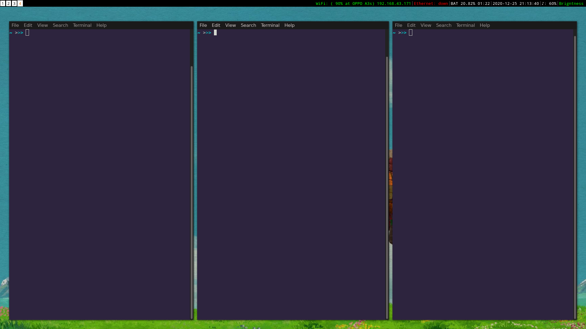
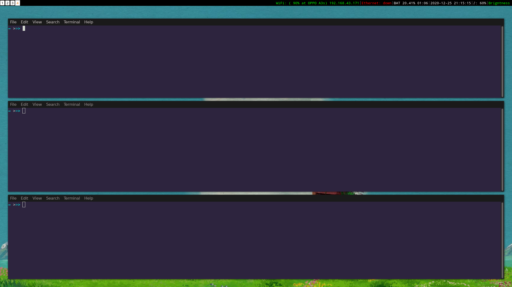
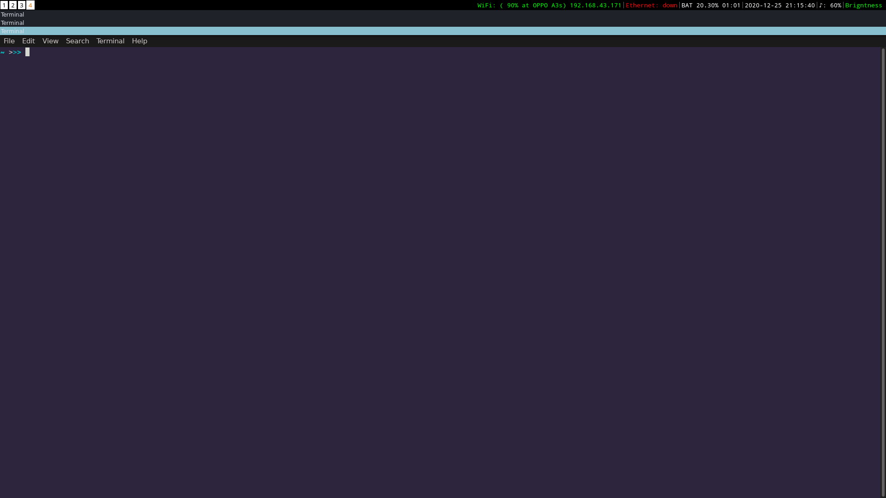
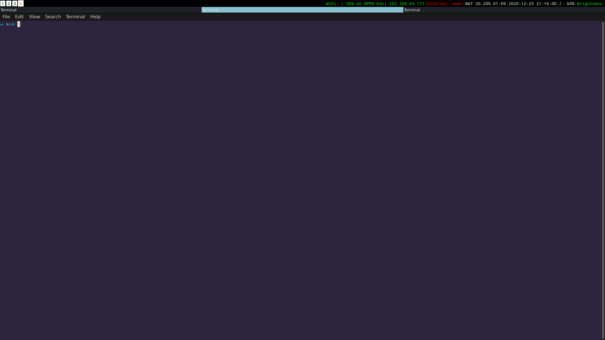

One of the best window managers out there, i3 is a **tiling window manager** designed for **X11**. A window manager is a part of the desktop environment that controls the placement and appearance of windows within a windowing system in a graphical user interface (GUI). A desktop environment consists of even more components like compositors, file managers, display servers, etc. along with a windows manager which together gives the looks and feels of the GUI. Using a windows manager can be really helpful if you don't need all those fancy tweakings and just want to use a lightweight and highly customizable GUI. 


i3 is a **tiling** windows manager which stacks your windows in proper stacks and tiles to efficiently use all the space. According to its official website:

> The usual elitism amongst minimal window managers: Don’t be bloated, don’t be fancy (simple borders are the most decoration we want to have). 
However, we do not enforce unnecessary limits such as a maximum amount of source lines of code. If it needs to be a bit bigger, it will be.


Features
Getting Started
Desing Principles
Configurations
Third-Party Customisations
Conclusion



## Features 
- Easy configuration using a plain text file which can be executed during runtime with restarting the services.
- Well-maintained documentations (one of the best I've seen for any windows manager). 
- Uses a tree as the abstraction (and underlying data structure) for window management.
- Implements different modes, similar to the text editor vi and vim. That is, keys have different functions depending on the mode that the window manager is in.
- Uses asynchronous **XCB** library instead of the old, synchronous **XLIB**.

## Getting started
i3 is available for the following operating systems/distributions:


You can also download the official tarball from their [downlaoad page](https://i3wm.org/downloads/).

To run it, simply add the following line in  `~/.xsession` or `~/.xinitrc`:
```
exec i3
```

Logout and then during logging in, click on the gear icon on your display manager (GDM if you're using GNOME) and select `i3`.

On your first login, you are presented with the i3 configuration screen. Press ENTER to generate a config file in your `~/.config/i3` directory. Later you can use this config file to further customize i3's behavior. On the next screen, you need to select your **Mod** key. This is important, as the **Mod** key is used to trigger most of i3's keyboard shortcuts.

To open up a terminal, press `Mod + ENTER`.
The default keybindings are illustrated [here](https://i3wm.org/docs/userguide.html#_default_keybindings).

---
**Video Resource**

A three-part series of screencasts created by Alex Booker illustrating what i3 is, how to use it, how to configure it, and how to customize its appearance can be found [here](https://www.youtube.com/watch?v=j1I63wGcvU4&list=PL5ze0DjYv5DbCv9vNEzFmP6sU7ZmkGzcf). 

---

## Desing Principles

- **Operation modes**

Traversing through these windows is just like tree traversal. Now you have different modes of operation, and each mode tweaks the layout, but all in all, it is just a tree data structure underneath. For example, when you start i3 with a single monitor, a single workspace and you open two terminal windows, you will end up with a tree-like this:
[two terminals on a workspace](https://i3wm.org/docs/tree-layout2.png)

  - **Splitv Mode**

  This mode is used for opening windows that are vertically split. To activate this mode, simple press `Mod + v`. 
  
  
  - **Splith Mode**

  This mode is used for opening windows that are horizontally split. To activate this mode, simple press `Mod + h`.
  

  - **Stack Mode**

  Stack mode will place every tab on top of each other like a stack. To activate stack mode press `Mod + s`.
  

  - **Tabbed Mode**

  The tabbed mode is exactly like the stack mode, the only difference being that it visually places the windows as tabs (the kind you might see on a browser). To activate it, press `Mod + w`.
  

- **i3 bar**

The bar at the bottom of your monitor is drawn by a separate process called i3bar. By default, it is placed at the bottom but of course, can be modified to be at the top with a lot of other customizations.

- **Workspaces**

Workspaces are shown in the bar and are numbered from 1-9 by default. You can change the name of the workspaces and a lot of other customizations according to your specific needs. To change to a different workspace press `Mod` + *workspace_number*.

## Configurations
The i3 configuration lies in `~/.config/i3/config` file. It uses an easy to use the syntax for defining parameters, all of which are properly explained in details in the [official documentation](https://i3wm.org/docs/userguide.html). After making any changes, press `Mod + Shift + r` for the change to take effect and you're good to go.

- **Mod keys**

You can change the default `Mod` key to be either `Alt` (**Mod1**) or `Windows` (**Mod4**) in the config file.

- **Keybindings**

i3 allows you to bind commands either on keycodes or key symbols (keysym). The syntax to set keybindings and keysyms are:

```
bindsym [--release] [<Group>+][<Modifiers>+]<keysym> command
bindcode [--release] [<Group>+][<Modifiers>+]<keycode> command
```

For example:

```
# Restart
bindsym $mod+Shift+r restart

# Notebook-specific hotkeys
bindcode 420 exec --no-startup-id /home/sachin/bind.sh
```

For more details visit [here](https://i3wm.org/docs/userguide.html#keybindings).

- **i3 bar**

Configuring your workspace bar starts with opening a `bar` block. You can have multiple bar blocks to use different settings for different outputs:

```
bar {
    status_command i3status
}
```
For further details for each bar components, go [here](https://i3wm.org/docs/userguide.html#_configuring_i3bar).

- **dmenu**

You can also use the handy `dmenu` which is opened by pressing <Mod + d> by default. Just type the name (or a part of it) of the application which you want to open. The corresponding application has to be in your `$PATH` for this to work.

- **TouchPad**

Using **libinput** we can configure settings for our touchpads. It's not i3 specific, but I struggled with it a bit, so I think it's worth mentioning here.

Add the following in `/etc/X11/xorg.conf.d/90-touchpad.conf`

```
Section "InputClass"
    Identifier "touchpad"
    MatchIsTouchpad "on"
    Driver "libinput"
    Option "Tapping" "on"
    Option "TappingButtonMap" "lrm"
    Option "NaturalScrolling" "on"
    Option "ScrollMethod" "twofinger"
EndSection
```

More options [here](https://jlk.fjfi.cvut.cz/arch/manpages/man/libinput.4).

## Third-Party Customisations
There are many other available tools that are not part of the official i3-wm but can really add to the aesthetics of your GUI when using a windows manager.

- **Polybar**

Polybar helps you to build beautiful status bars apart from the default i3-bar (which you can disable). There's a bit of learning involved to get the syntax to create your own polybar but it's worth learning if you want full control over the bar customization. You can learn all about it [here](https://github.com/polybar/polybar/wiki).

- **Picom**

Picom is a standalone compositor for Xorg. Picom is a fork of compton, which is a fork of xcompmgr-dana, which in turn is a fork of xcompmgr (how neat!).

You can learn all about it on the [project's repository](https://github.com/yshui/picom).

## Conclusion
i3 is free of bloat, is very easy to learn, and a very light alternative to the conventional Desktop Environments. Its excellent documentation which encourages collaboration along with a great community makes it one of the best windows managers out there. There are still many more like dwm, Awesome, Bspwm, etc. which have their flairs. But for now, I'm gonna stick to i3.

Not convinced yet? Check out the beautiful customizations by wm users on this [subreddit](https://www.reddit.com/r/unixporn/).